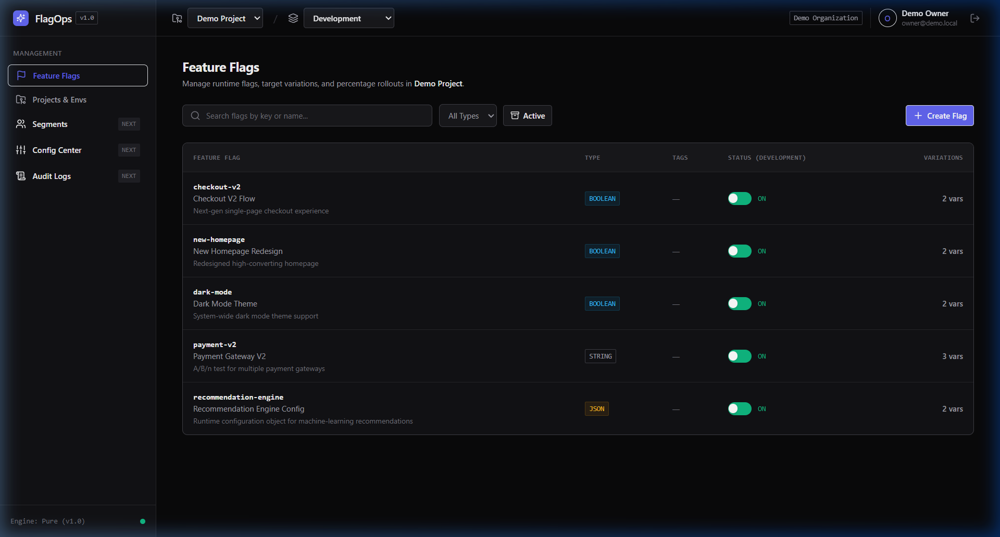
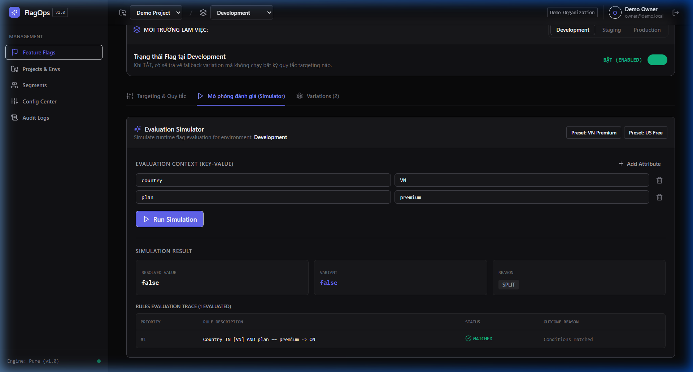
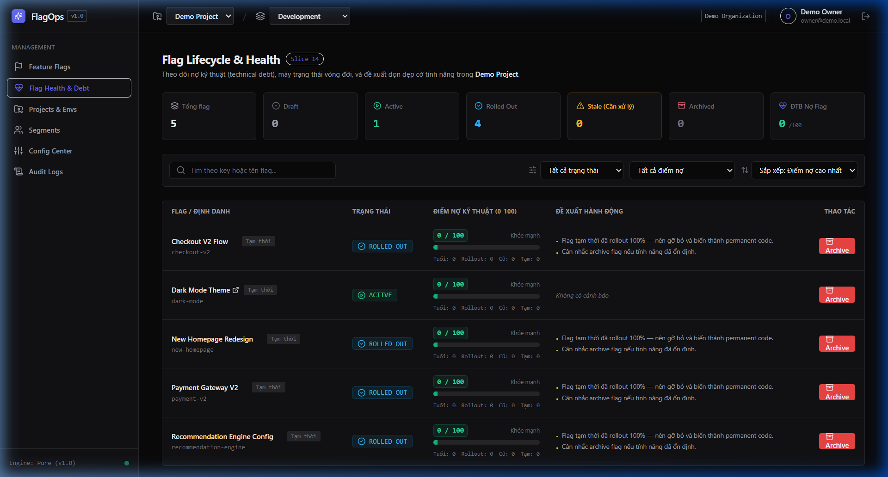
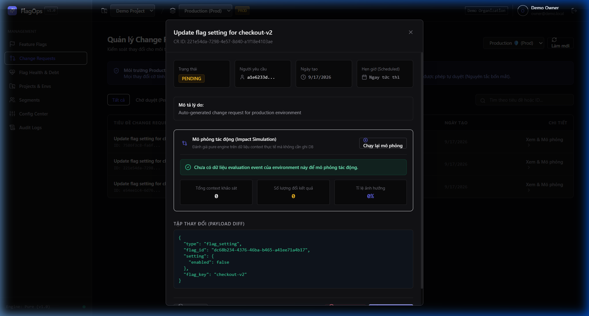

# FlagOps — Feature Flag & Application Configuration Platform

[](https://github.com/tranhoainam298/Feature-flag-control/actions/workflows/ci.yml)
[](https://www.python.org/)
[](https://fastapi.tiangolo.com/)
[](https://react.dev/)
[](https://openfeature.dev/)
[](LICENSE)

**FlagOps** là nền tảng quản trị **Feature Flag** (Công tắc tính năng) và **Application Configuration** (Cấu hình ứng dụng tập trung) cấp doanh nghiệp. Hệ thống cho phép phân tách hoàn toàn việc triển khai mã nguồn (Deployment) khỏi việc phát hành tính năng (Release), hỗ trợ phát hành lũy tiến (Canary / Percentage Rollout), ngắt khẩn cấp (Kill Switch), quản lý cấu hình tập trung có phiên bản bất biến (Snapshot Release & Rollback), đồng bộ thời gian thực qua Server-Sent Events (SSE) và tuân thủ 100% chuẩn mở **CNCF OpenFeature**.

---

## Giao diện Hệ thống (Screenshots)

| Quản lý Feature Flags & Variations | Trình mô phỏng Đánh giá (Simulation) |
|---|---|
|  |  |

| Giám sát Flag Health & Nợ Kỹ thuật | Phê duyệt Thay đổi Production (Change Request) |
|---|---|
|  |  |

---

## Quick Start (Khởi động chỉ với 3 lệnh)

Chỉ cần máy tính có Docker & Docker Compose:

```bash
# 1. Sao chép biến môi trường mẫu
cp .env.example .env

# 2. Khởi động toàn bộ cụm dịch vụ (API, Web, Postgres, Redis, Demo App)
docker compose up -d --build

# 3. Nạp dữ liệu mẫu (Sample Organization, Flags, Segments, Releases)
make seed
```

Sau khoảng 1–2 phút khởi động, các cổng dịch vụ sẵn sàng truy cập:
- **Web Dashboard**: [http://localhost:3000](http://localhost:3000) (Đăng nhập mẫu: `admin@example.com` / `Admin123456!`)
- **Interactive OpenAPI Docs**: [http://localhost:8000/docs](http://localhost:8000/docs)
- **Demo Client Application**: [http://localhost:3001](http://localhost:3001)

---

## Kiến trúc Tổng quan (Architecture Summary)

FlagOps được xây dựng theo kiến trúc 4 tầng phân tách nghiêm ngặt:

```
┌─────────────────────────────────────────────────────────────┐
│                    Web Dashboard (React 18 + TS + Vite)     │
└──────────────────────────────┬──────────────────────────────┘
                               │ HTTPS / JWT
                               ▼
┌─────────────────────────────────────────────────────────────┐
│                 FlagOps Core API (FastAPI + Python 3.12)     │
│   ├── Admin API (/api/v1)        ├── SSE Hub (/eval/v1/stream)│
│   ├── Eval API (/eval/v1)        └── Scheduler (APScheduler)  │
│   └── Pure Evaluation Engine (Zero I/O, MurmurHash3, 15µs)  │
└──────────────┬───────────────────────────────┬──────────────┘
               │                               │
               ▼                               ▼
      PostgreSQL 16 (Source of Truth)     Redis 7 (Cache & Pub/Sub)
```

1. **Evaluation Engine Pure 100%**: Không thực hiện I/O, không gọi database hay redis bên trong engine, xử lý đánh giá trong $< 15\ \mu\text{s}$, cho phép nhúng trực tiếp vào Python SDK (In-process evaluation).
2. **Tách biệt 2 đường đọc/ghi**: Đường quản trị (JWT, DB write) tách biệt hoàn toàn với đường đánh giá (API Key, Redis/In-memory cache tốc độ cao).
3. **Phân phối Realtime**: Sử dụng Redis Pub/Sub kết hợp SSE Hub để phát sự kiện xuống các client SDK trong $< 2\ \text{giây}$.
4. **Bộ nhớ đệm 3 tầng**: RAM SDK $\longrightarrow$ Redis Cluster $\longrightarrow$ PostgreSQL 16.

---

## Danh mục Tính năng (Feature Breakdown)

### 1. Quản trị Feature Flag
- Hỗ trợ 4 kiểu dữ liệu: `BOOLEAN`, `STRING`, `NUMBER`, `JSON`.
- Phân loại toggle theo Martin Fowler: `RELEASE`, `EXPERIMENT`, `OPS`, `PERMISSION`.
- Cấu hình độc lập theo môi trường (`dev`, `staging`, `prod`): bật/tắt, default variation, off variation.
- Lưu trữ mềm (Soft-delete / Archive) an toàn không gây gãy mã nguồn.

### 2. Targeting Rules & Phân đoạn (Segment)
- Bộ toán tử 14 phép so sánh: `==`, `!=`, `>`, `<`, `>=`, `<=`, `IN`, `NOT_IN`, `CONTAINS`, `STARTS_WITH`, `ENDS_WITH`, `MATCHES_REGEX` (an toàn chống ReDoS), `SEMVER_GT`, `SEMVER_LT`.
- Phép ghép điều kiện `AND` trong nhóm và `OR` giữa các nhóm.
- Đánh giá theo thứ tự ưu tiên (`priority`), rule khớp đầu tiên sẽ thắng.
- Gán cứng biến thể cho cá nhân (Individual Overrides).

### 3. Phân bổ Phần trăm Ổn định (Sticky Rollout)
- Thuật toán MurmurHash3 32-bit với độ phân giải 0.01% ($10.000$ khoảng băm).
- Ghép salt `flag_key:rule_id:context_value` đảm bảo các flag độc lập với nhau.
- Chứng minh tính xác định (Deterministic), đồng đều (Uniform), và đơn điệu (Monotonic) bằng kiểm thử thuộc tính Hypothesis.

### 4. Quản lý Cấu hình Ứng dụng (Remote Config)
- Quản lý theo `Namespace` gắn với môi trường.
- Cơ chế chỉnh sửa nháp (Draft staging) kèm xác thực JSON Schema.
- Lưu trữ bản phát hành bất biến (Snapshot Release) có lịch sử phiên bản.
- Trình so sánh Visual Diff 3 chiều (Added, Modified, Removed).
- Rollback nguyên tử về bất kỳ bản release nào trong quá khứ.
- Mã hóa dữ liệu mật (Secret Config) bằng chuẩn AES-256-GCM.

### 5. Kiểm soát Thay đổi & Nợ Kỹ thuật (Governance)
- **Change Request (Quy trình 4 mắt)**: Môi trường Production bắt buộc tạo đề xuất duyệt, cấm người tạo tự duyệt, mô phỏng tác động (Impact Simulation) trước khi apply.
- **Hẹn giờ thay đổi (Scheduled Change)**: Lên lịch bật/tắt tự động vào thời điểm định trước.
- **Điểm nợ kỹ thuật (Debt Score)**: Tự động chấm điểm 0–100 cảnh báo cờ chết đã rollout 100% quá 30 ngày.
- **Audit Log**: Ghi nhận toàn diện: ai thay đổi, lúc nào, giá trị trước/sau, IP trạm.

---

## Hướng dẫn Sử dụng SDK (Python SDK)

Package `flagops-sdk` hỗ trợ cả 2 chế độ: Đánh giá tại chỗ (In-process, siêu tốc) và Đánh giá từ xa (Remote HTTP).

### 1. Cài đặt SDK
```bash
pip install -e sdk/python
```

### 2. Khởi tạo Client và Đánh giá Flag
```python
from flagops import FlagOpsClient

# Khởi tạo client kết nối tới FlagOps Server
client = FlagOpsClient(
    base_url="http://localhost:8000",
    api_key="fo_srv_dev_secret_key_demo_12345678",
    mode="in_process",         # "in_process" hoặc "remote"
    enable_streaming=True,     # Lắng nghe cập nhật realtime qua SSE
    polling_interval=30.0,     # Dự phòng polling ETag mỗi 30s
)

# Đánh giá cờ Boolean
context = {"targetingKey": "user-1002", "country": "VN", "plan": "premium"}
if client.is_enabled("checkout-v2", context=context, default=False):
    print("Hiển thị giao diện thanh toán mới V2")
else:
    print("Hiển thị giao diện thanh toán cũ V1")

# Lấy giá trị cờ kiểu String / Number / JSON
tier = client.get_string("loyalty-tier", context=context, default="bronze")
discount = client.get_number("discount-rate", context=context, default=0.0)
config_obj = client.get_json("payment-gateways", context=context, default={"stripe": True})

# Đọc cấu hình dịch vụ từ Remote Config
payment_config = client.get_config_namespace("payment")
print("Timeout ms:", payment_config.get("timeout_ms", 5000))

# Đóng kết nối khi tắt app
client.close()
```

### 3. Sử dụng Chuẩn CNCF OpenFeature Provider
FlagOps cung cấp Provider tuân thủ chuẩn OpenFeature, giúp ứng dụng không bị phụ thuộc nhà cung cấp (Zero Vendor Lock-in):

```python
from openfeature import api
from openfeature.evaluation_context import EvaluationContext
from flagops.openfeature import FlagOpsProvider

# Đăng ký Provider của FlagOps (chỉ 1 dòng duy nhất)
api.set_provider(FlagOpsProvider(
    base_url="http://localhost:8000",
    api_key="fo_srv_dev_secret_key_demo_12345678"
))

# Toàn bộ code nghiệp vụ chỉ tương tác với chuẩn OpenFeature
of_client = api.get_client()
eval_ctx = EvaluationContext(targeting_key="user-123", attributes={"country": "VN"})

is_v2 = of_client.get_boolean_value("checkout-v2", False, eval_ctx)
print("OpenFeature evaluation result:", is_v2)
```

---

## Hướng dẫn Công cụ Quét Cờ Chết (Flag-Scanner CLI)

Công cụ `flag-scanner` sử dụng module phân tích cú pháp tĩnh `ast` của Python và Regex để quét toàn bộ repository, phát hiện các cờ đã bị xóa hoặc cờ đã 100% rollout quá hạn (Dead Flags / Stale Flags).

```bash
# 1. Khởi tạo tệp cấu hình
flag-scanner init

# 2. Quét mã nguồn dự án
flag-scanner scan ./demo-app \
  --api-url http://localhost:8000 \
  --api-key fo_srv_dev_secret_key_demo_12345678

# 3. Xuất báo cáo nợ kỹ thuật dạng Markdown
flag-scanner report --output docs/flag-debt-report.md

# 4. Tích hợp cổng chặn CI/CD (Thất bại nếu có cờ chết nguy hiểm)
flag-scanner scan ./src --fail-on-dead
```

---

## Bảng Biến Môi trường (Configuration Variables)

| Tên biến | Kiểu | Mặc định | Ý nghĩa |
|---|---|---|---|
| `DATABASE_URL` | String | `postgresql+asyncpg://...` | Chuỗi kết nối PostgreSQL bất đồng bộ |
| `REDIS_URL` | String | `redis://localhost:6379/0` | Chuỗi kết nối Redis cache & pub/sub |
| `SECRET_KEY` | String | *bắt buộc* | Khóa băm ký JWT token (tối thiểu 32 ký tự) |
| `JWT_ALGORITHM` | String | `HS256` | Thuật toán ký JWT |
| `ACCESS_TOKEN_EXPIRE_MINUTES` | Int | `30` | Thời gian sống của Access Token |
| `REFRESH_TOKEN_EXPIRE_DAYS` | Int | `7` | Thời gian sống của Refresh Token |
| `CONFIG_MASTER_KEY` | String | *bắt buộc 32 bytes* | Khóa mã hóa đối xứng AES-256-GCM cho config secrets |
| `EVAL_RATE_LIMIT_PER_MINUTE` | Int | `1000` | Ngưỡng giới hạn request cho mỗi API key trong 1 phút |
| `RULESET_CACHE_TTL_SECONDS` | Int | `300` | Thời gian sống TTL của ruleset cache trên Redis |
| `LOG_LEVEL` | String | `INFO` | Mức độ log (`DEBUG`, `INFO`, `WARNING`, `ERROR`) |
| `CORS_ORIGINS` | String | `http://localhost:3000` | Danh sách domain được phép gọi API (phân tách bởi dấu phẩy) |

---

## Tham khảo & Bản quyền Thiết kế (References & Design Attribution)

Trong quá trình nghiên cứu và xây dựng FlagOps, chúng tôi đã khảo sát sâu sắc các dự án mã nguồn mở hàng đầu trong ngành để học hỏi tư duy thiết kế hệ thống:

1. **[Flagsmith](https://github.com/Flagsmith/flagsmith)** (BSD-3-Clause): Học hỏi mô hình kết hợp hài hòa giữa Feature Flagging và Remote Configuration trên cùng một nền tảng; tư duy phân tách môi trường.
2. **[Unleash](https://github.com/Unleash/unleash)** (Apache-2.0): Tham chiếu chiến lược phân bổ Activation Strategies, thiết kế giao diện trực quan cho Rule Builder và quản lý vòng đời cờ.
3. **[GO Feature Flag](https://github.com/thomaspoignant/go-feature-flag)** (MIT): Học hỏi nguyên lý xây dựng Evaluation Engine sạch, độc lập, tối giản và thuật toán MurmurHash percentage rollout.
4. **[OpenFeature](https://open-feature.dev/)** (CNCF): Tuân thủ đặc tả giao diện chuẩn OpenFeature Specification v0.7.0, chuẩn hóa Reason Codes, Error Codes và Provider Architecture.
5. **[Apollo Config](https://github.com/apolloconfig/apollo)** (Apache-2.0): Học hỏi tư duy quản trị cấu hình phân tán: Namespace, Immutable Snapshot Releases, Visual Diff và Rollback nguyên tử.

> **Tuyên bố Tự chủ Mã nguồn**:
> Toàn bộ kiến trúc và mã nguồn thực thi của hệ thống FlagOps (FastAPI Backend, Pure Evaluation Engine, React Web Dashboard, Python SDK, OpenFeature Provider và CLI flag-scanner) đều được **đội ngũ dự án tự viết mới 100% từ đầu**, hoàn toàn không sao chép nguyên mẫu mã nguồn từ các hệ thống tham khảo trên.
