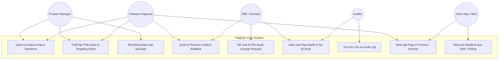

# FlagOps — Đặc tả Yêu cầu Phần mềm (Software Requirements Specification - SRS)

## 1. Giới thiệu (Introduction)

### 1.1. Mục đích tài liệu
Tài liệu Đặc tả Yêu cầu Phần mềm (SRS) này xác định các yêu cầu chức năng (Functional Requirements) và yêu cầu phi chức năng (Non-Functional Requirements) cho hệ thống **FlagOps** — Nền tảng Quản trị Feature Flag và Cấu hình Ứng dụng Tập trung (Feature Flagging & Remote Configuration Platform).

### 1.2. Phạm vi sản phẩm
FlagOps cung cấp nền tảng toàn diện giúp các tổ chức phần mềm thực hiện:
- Phân tách hoàn toàn giữa **Triển khai (Deployment)** và **Phát hành (Release)**.
- Triển khai lũy tiến (Progressive Delivery / Canary Releases), quản lý rủi ro mã nguồn bằng công tắc khẩn cấp (Kill Switch).
- Quản lý cấu hình tập trung nhiều môi trường có lịch sử phiên bản (Versioned Releases), mã hóa dữ liệu bí mật và hỗ trợ hoàn tác (Rollback).
- Phân phối thời gian thực với độ trễ thấp thông qua Server-Sent Events (SSE) và chuẩn mở OpenFeature CNCF.

---

## 2. Tác nhân Hệ thống (System Actors)

| Tác nhân | Vai trò trong hệ thống | Trách nhiệm chính |
|---|---|---|
| **Product Manager (PM)** | Người quản lý sản phẩm | Định nghĩa biến thể tính năng, kích hoạt flag, thiết lập % rollout thử nghiệm cho người dùng theo thị trường/gói dịch vụ. |
| **Software Engineer (Developer)** | Kỹ sư phát triển phần mềm | Tích hợp FlagOps SDK vào ứng dụng khách; khai báo cờ tính năng; định nghĩa các điều kiện kỹ thuật và cấu hình tham số dịch vụ. |
| **SRE / DevOps Engineer** | Kỹ sư vận hành hạ tầng | Quản lý môi trường (Dev/Staging/Prod), kiểm soát API Key, thiết lập quy trình duyệt Change Request trên Production, kích hoạt Kill Switch khẩn cấp khi có sự cố. |
| **Auditor / Security Officer** | Cán bộ kiểm toán & bảo mật | Tra cứu lịch sử thay đổi qua Audit Log; giám sát các quyền truy cập RBAC; quét các cờ tính năng quá hạn (Stale Flag Debt). |
| **Client Application (SDK)** | Hệ thống phần mềm bên ngoài | Đóng vai trò consumer, định kỳ polling hoặc duy trì kết nối SSE để đồng bộ ruleset và evaluate cờ tính năng tại chỗ (In-process). |

---

## 3. Các Use Case Trọng yếu (Key Use Cases)

### 3.1. Danh mục Use Cases chi tiết

1. **UC-01: Tạo và cấu hình Feature Flag**
   - *Actor*: Developer, Product Manager.
   - *Luồng chính*: Người dùng nhập Key bất biến, tên hiển thị, kiểu dữ liệu (`BOOLEAN`, `STRING`, `NUMBER`, `JSON`), loại toggle (`RELEASE`, `EXPERIMENT`, `OPS`, `PERMISSION`). Tạo danh sách các variations tương ứng.
2. **UC-02: Thiết lập Targeting Rules và Percentage Rollout**
   - *Actor*: Product Manager, Developer.
   - *Luồng chính*: Tạo nhóm điều kiện dựa trên các thuộc tính người dùng (`country`, `app_version`, `plan`). Thiết lập tỷ lệ phần trăm phân bổ bằng giải thuật MurmurHash3 sticky bucketing.
3. **UC-03: Mô phỏng đánh giá (Evaluation Simulation)**
   - *Actor*: Developer, Product Manager.
   - *Luồng chính*: Nhập dữ liệu context giả lập (`targetingKey`, `tier`, `country`) trên giao diện Web. Hệ thống trả về kết quả dự kiến kèm Trace giải thích từng rule.
4. **UC-04: Quản trị cấu hình và Rollback phiên bản**
   - *Actor*: Developer, SRE.
   - *Luồng chính*: Sửa đổi tham số cấu hình dạng nháp (Draft), kiểm tra Schema, xem bản so sánh Diff trực quan giữa bản nháp và bản hiện hành, thực hiện Publish Snapshot Release hoặc Rollback về phiên bản cũ.
5. **UC-05: Kiểm soát thay đổi Production (Change Request)**
   - *Actor*: Developer (Người yêu cầu), SRE / Admin (Người phê duyệt).
   - *Luồng chính*: Khi chỉnh sửa flag/config trên Production, hệ thống tạo bản ghi Change Request ở trạng thái `PENDING`. Người tạo không thể tự duyệt (Four-Eyes Principle). Người duyệt kiểm tra bảng đánh giá tác động (Impact Simulation) và ấn Approve để áp dụng trong một Transaction.
6. **UC-06: Đánh giá Flag tại chỗ với SDK (In-Process Evaluation)**
   - *Actor*: Client Application (SDK).
   - *Luồng chính*: SDK tải toàn bộ ruleset dạng nén kèm ETag, giải mã và đánh giá cục bộ trong bộ nhớ máy khách với thời gian dưới 10 microseconds, ghi nhận sự kiện batching và gửi về server.

---

## 4. User Stories

### Phân hệ Feature Flag
- **US-01**: Là một **Developer**, tôi muốn gắn cờ một tính năng mới trong code bằng lệnh `client.is_enabled("new-payment-flow", context)` để tôi có thể merge code vào branch chính (Trunk-Based Development) mà không làm ảnh hưởng người dùng hiện tại.
- **US-02**: Là một **Product Manager**, tôi muốn rollout tính năng mới cho 10% người dùng tại Việt Nam để đo lường độ ổn định trước khi mở rộng ra 100%.
- **US-03**: Là một **Product Manager**, tôi muốn khi tăng tỷ lệ rollout từ 10% lên 25%, tất cả những người dùng đã ở trong nhóm 10% ban đầu vẫn tiếp tục được trải nghiệm tính năng mới (Monotonicity).
- **US-04**: Là một **SRE Engineer**, tôi muốn có công tắc khẩn cấp (Kill Switch) để tắt ngay lập tức tính năng bên thứ ba khi dịch vụ đó gặp sự cố, chỉ mất dưới 2 giây để toàn bộ cụm máy chủ áp dụng.

### Phân hệ Cấu hình Ứng dụng (Remote Config)
- **US-05**: Là một **Developer**, tôi muốn lưu trữ các tham số cấu hình (như timeout, URL dịch vụ ngoài, cờ hạn mức) trên FlagOps thay vì tệp `.env` để có thể thay đổi ngay lập tức mà không cần rebuild container hoặc restart pod.
- **US-06**: Là một **SRE Engineer**, tôi muốn các khóa cấu hình nhạy cảm (API Secret Key, Database Password) được mã hóa AES-256-GCM ở tầng cơ sở dữ liệu để bảo vệ dữ liệu mật.
- **US-07**: Là một **Developer**, tôi muốn xem bản khác biệt (Visual Diff) giữa cấu hình nháp và cấu hình đang chạy trước khi phát hành để tránh nhầm lẫn sai sót cú pháp.
- **US-08**: Là một **SRE Engineer**, tôi muốn có nút "Rollback" để quay lại phiên bản cấu hình trước đó trong trường hợp bản phát hành mới gây lỗi runtime.

### Phân hệ Quản trị & Bảo mật
- **US-09**: Là một **Tech Lead**, tôi muốn bắt buộc mọi thay đổi trên môi trường Production phải thông qua quy trình phê duyệt 4 mắt (Change Request) để đảm bảo không một cá nhân nào có thể tự ý thay đổi hệ thống trực tiếp.
- **US-10**: Là một **Auditor**, tôi muốn tra cứu lịch sử thay đổi (Audit Log) theo thời gian, theo người dùng và xem trạng thái trước/sau để phục vụ đánh giá tuân thủ quy chuẩn ISO/IEC 27001 hoặc SOC 2.
- **US-11**: Là một **Tech Lead**, tôi muốn chạy công cụ CLI `flag-scanner` trên CI/CD pipeline để tự động cảnh báo các flag đã hoàn tất 100% rollout nhưng lập trình viên quên chưa xóa khỏi mã nguồn (Flag Debt).

---

## 5. Yêu cầu Chức năng (Functional Requirements)

### FR-1: Quản trị Tổ chức, Phân quyền & Định danh
- **FR-1.1**: Hỗ trợ đăng ký tài khoản, đăng nhập an toàn, cấp phát Access Token (JWT) và Refresh Token có cơ chế thu hồi.
- **FR-1.2**: Phân cấp mô hình 3 tầng cô lập: `Organization` → `Project` → `Environment`.
- **FR-1.3**: Phân quyền theo vai trò RBAC:
  - `OWNER`: Toàn quyền trên tổ chức, xóa tổ chức, quản lý thành viên.
  - `ADMIN`: Quản lý dự án, cấu hình môi trường, duyệt Change Request.
  - `DEVELOPER`: Tạo và sửa flag/config trên Dev/Staging, tạo đề xuất Change Request trên Production.
  - `VIEWER`: Chỉ xem thông tin, không thể sửa đổi (Read-only).
- **FR-1.4**: Cấp phát API Key theo môi trường, tách biệt giữa `SERVER` key (toàn quyền đọc ruleset bí mật) và `CLIENT` key (chỉ đọc các flag công khai `is_client_visible=true`).

### FR-2: Quản lý Cờ Tính năng (Feature Flag Management)
- **FR-2.1**: Hỗ trợ 4 kiểu dữ liệu biến thể: `BOOLEAN`, `STRING`, `NUMBER`, `JSON`.
- **FR-2.2**: Khóa cờ (`key`) là chuỗi bất biến trong suốt vòng đời của flag.
- **FR-2.3**: Cho phép cấu hình trạng thái bật/tắt (`enabled`) và biến thể mặc định độc lập trên từng môi trường (`dev`, `staging`, `prod`).
- **FR-2.4**: Hỗ trợ gắn thẻ (tags), mô tả và phân loại toggle theo Martin Fowler (`RELEASE`, `EXPERIMENT`, `OPS`, `PERMISSION`).
- **FR-2.5**: Cơ chế lưu trữ và khôi phục (Soft-delete / Archive) để không làm gãy mã nguồn ứng dụng đang chạy.

### FR-3: Nhắm mục tiêu & Phân bổ (Targeting & Rollout)
- **FR-3.1**: Định nghĩa Phân đoạn người dùng (Segment) với 14 toán tử so sánh đầy đủ:
  - So sánh giá trị: `==`, `!=`, `>`, `<`, `>=`, `<=`.
  - So sánh tập hợp: `IN`, `NOT_IN`.
  - So sánh chuỗi: `CONTAINS`, `NOT_CONTAINS`, `STARTS_WITH`, `ENDS_WITH`, `MATCHES_REGEX` (an toàn chống ReDoS).
  - So sánh phiên bản ngữ nghĩa (SemVer): `SEMVER_EQ`, `SEMVER_GT`, `SEMVER_GTE`, `SEMVER_LT`, `SEMVER_LTE`.
- **FR-3.2**: Ghép điều kiện logic: `AND` trong nội bộ một nhóm điều kiện, `OR` giữa các nhóm điều kiện khác nhau.
- **FR-3.3**: Hệ thống luật nhắm mục tiêu (Targeting Rules) có thứ tự ưu tiên (`priority`), luật khớp đầu tiên sẽ quyết định biến thể trả về.
- **FR-3.4**: Thuật toán chia phần trăm ổn định (Sticky Percentage Rollout) sử dụng giải thuật MurmurHash3 64-bit, đảm bảo tính nhất quán (Consistent), tính phân bố đồng đều (Uniform) và tính tăng dần (Monotonic).
- **FR-3.5**: Hỗ trợ ghi đè cá nhân (Individual Overrides) cho phép gán cứng biến thể cho danh sách người dùng chỉ định.

### FR-4: Đánh giá Cờ (Flag Evaluation Engine)
- **FR-4.1**: Cung cấp API đánh giá đơn lẻ `POST /eval/v1/flags/{key}` và hàng loạt `POST /eval/v1/flags`.
- **FR-4.2**: Trả về kết quả đánh giá tuân thủ chuẩn OpenFeature với các trường: `value`, `variant`, `reason` (`TARGETING_MATCH`, `SPLIT`, `DEFAULT`, `DISABLED`, `ERROR`), và `flagMetadata`.
- **FR-4.3**: Cung cấp endpoint tải toàn bộ cấu hình `GET /eval/v1/ruleset` hỗ trợ Header `If-None-Match` và mã phản hồi `304 Not Modified`.
- **FR-4.4**: Cung cấp công cụ mô phỏng đánh giá (Simulation API) có giải thích chi tiết vết thực thi (Evaluation Trace).

### FR-5: Quản trị Cấu hình Ứng dụng (Remote Config)
- **FR-5.1**: Hỗ trợ phân nhóm cấu hình theo Namespace trong môi trường.
- **FR-5.2**: Quản lý từng mục cấu hình (Config Item) với trạng thái nháp (Draft staging), kiểm tra giá trị bằng JSON Schema.
- **FR-5.3**: Cơ chế phát hành Snapshot Release bất biến: mỗi lần Publish tạo một bản ghi phiên bản mới với version tăng tự động, lưu toàn bộ snapshot giá trị.
- **FR-5.4**: Cho phép so sánh Diff trực quan giữa 2 bản phát hành bất kỳ hoặc giữa bản nháp với bản phát hành hiện hành.
- **FR-5.5**: Hỗ trợ Rollback nguyên tử về bất kỳ bản phát hành nào trước đó.
- **FR-5.6**: Hỗ trợ cờ `is_secret`, tự động mã hóa giá trị bằng thuật toán AES-256-GCM với khóa chủ (Master Key) 32 bytes trước khi ghi xuống đĩa.

### FR-6: Phân phối Thời gian thực & Bộ nhớ đệm (Distribution & Caching)
- **FR-6.1**: Cung cấp kênh truyền phát thời gian thực Server-Sent Events (SSE) tại `/eval/v1/stream` với heartbeat tự động mỗi 25 giây.
- **FR-6.2**: Đồng bộ trạng thái đa tiến trình thông qua Redis Pub/Sub: khi có thay đổi trên flag hoặc config, API gửi thông điệp invalidation lên Redis, SSE Hub lập tức đẩy sự kiện `ruleset_updated` xuống tất cả các SDK client.
- **FR-6.3**: Cơ chế bộ nhớ đệm 3 tầng: Bộ nhớ đệm RAM SDK → Redis Ruleset Cache (TTL 1 giờ) → PostgreSQL Source of Truth.

### FR-7: Kiểm soát Thay đổi & Nợ Kỹ thuật (Governance & Health)
- **FR-7.1**: Tính năng Change Request với máy trạng thái nghiêm ngặt (`DRAFT` → `PENDING` → `APPROVED` → `APPLIED`), bắt buộc nguyên tắc 4 mắt (chống tự duyệt) và hỗ trợ hẹn giờ áp dụng tự động (`scheduled_at`).
- **FR-7.2**: Thuật toán tính điểm nợ kỹ thuật (Technical Debt Score) theo thang điểm 0–100 dựa trên tuổi cờ, trạng thái 100% rollout, và thời gian không còn được evaluate.
- **FR-7.3**: Công cụ dòng lệnh `flag-scanner` độc lập, sử dụng module `ast` của Python để phân tích tĩnh cú pháp mã nguồn, phát hiện các dead flag trong dự án.

---

## 6. Yêu cầu Phi Chức năng (Non-Functional Requirements)

### NFR-1: Hiệu năng & Độ trễ (Performance & Latency)
- **Đánh giá tại chỗ (In-process evaluation)**: Thời gian đánh giá cờ phải đạt mức microsecond ($< 15\ \mu\text{s}$ ở p99). Thông lượng đạt trên 200.000 phép đánh giá/giây trên một luồng CPU chuẩn.
- **Đánh giá qua mạng (Remote HTTP evaluation)**: Độ trễ phản hồi API tại `/eval/v1/flags` phải đạt $\le 10\ \text{ms}$ ở p95 và $\le 20\ \text{ms}$ ở p99 khi cache Redis trúng (Cache Hit).
- **Độ trễ truyền phát thời gian thực (Realtime SSE propagation)**: Từ thời điểm người dùng nhấn nút bật/tắt cờ trên Web Dashboard cho đến khi ứng dụng khách (SDK) nhận được sự kiện cập nhật phải dưới $2.0\ \text{giây}$.

### NFR-2: Tính Khả dụng & Độ tin cậy (Availability & Reliability)
- **Nguyên tắc Fail-Safe (Không bao giờ sập ứng dụng khách)**: SDK tuyệt đối không bao giờ ném exception chưa bắt ra ứng dụng nghiệp vụ khi mất kết nối mạng hoặc server FlagOps gặp sự cố. Trong mọi trường hợp lỗi, SDK phải lập tức trả về giá trị mặc định (Default Value) do lập trình viên truyền vào.
- **Bộ đệm sự cố (Stale Cache Fallback)**: Khi mất kết nối tới máy chủ FlagOps, SDK tiếp tục sử dụng bản ruleset hợp lệ cuối cùng trong bộ nhớ đệm nội bộ.

### NFR-3: An toàn & Bảo mật (Security & Hardening)
- **Bảo vệ ranh giới tổ chức (Tenancy Isolation)**: Khi người dùng thuộc Organization A cố tình truy cập vào tài nguyên của Organization B, hệ thống phải trả về mã lỗi `404 Not Found` (thay vì `403 Forbidden`) để ngăn chặn việc dò quét sự tồn tại của tài nguyên (Information Disclosure).
- **Chống tấn công từ chối dịch vụ Regular Expression (ReDoS)**: Các toán tử so sánh chuỗi bằng Regex phải được bao bọc bởi cơ chế kiểm soát thời gian xử lý tối đa ($< 200\ \text{ms}$), từ chối ngay lập tức các biểu thức regex lồng nhau dạng `(a+)+$`.
- **Giới hạn độ sâu dữ liệu (JSON Depth Guard)**: Cây điều kiện lọc JSONB chỉ cho phép lồng tối đa 10 tầng; các payload vượt quá ngưỡng này phải bị từ chối với mã lỗi `400 CONDITION_DEPTH_EXCEEDED`.
- **Bảo mật dữ liệu cá nhân (GDPR Compliance)**: Khi gửi sự kiện đánh giá về server, thông tin định danh người dùng (`targetingKey` hoặc `user_id`) bắt buộc phải được băm một chiều SHA-256 (`context_key_hash`), không lưu trữ trực tiếp thông tin nhạy cảm ở dạng bản rõ.

### NFR-4: Khả năng Bảo trì & Tiêu chuẩn Mã nguồn (Maintainability & Quality)
- **Độ thuần khiết của Engine (Purity)**: Module `app/engine/` là hàm thuần túy không có tác dụng phụ (Pure function), không import thư viện I/O (SQLAlchemy, Redis, HTTP client, file system, `datetime.now`, `random`).
- **Độ bao phủ kiểm thử (Test Coverage Gate)**:
  - Toàn bộ backend: độ bao phủ kiểm thử tối thiểu $\ge 75\%$.
  - Module `app/engine/`: độ bao phủ kiểm thử bắt buộc $\ge 95\%$.
- **Tuân thủ chuẩn mở CNCF OpenFeature**: Toàn bộ hệ thống SDK và API evaluation tuân thủ 100% đặc tả chuẩn OpenFeature, cho phép người dùng thay thế nhà cung cấp chỉ bằng 1 dòng cấu hình provider duy nhất.
