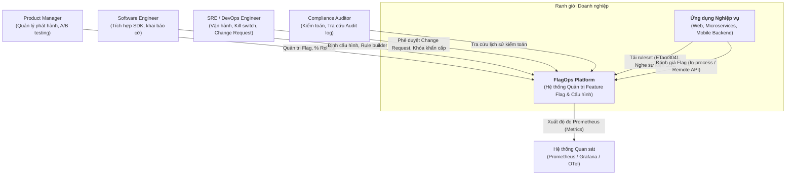
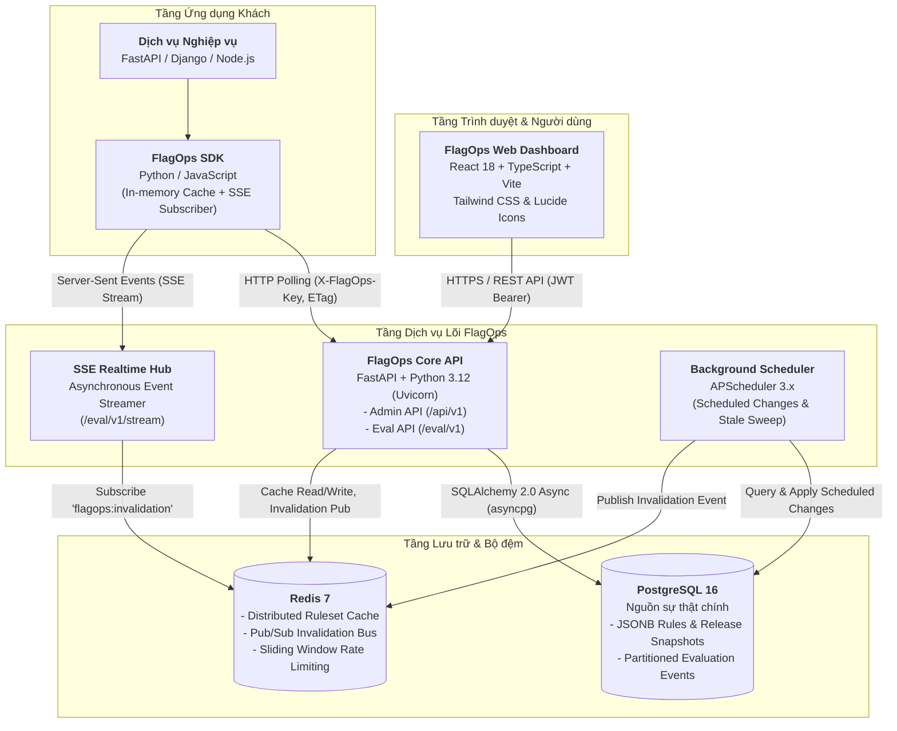
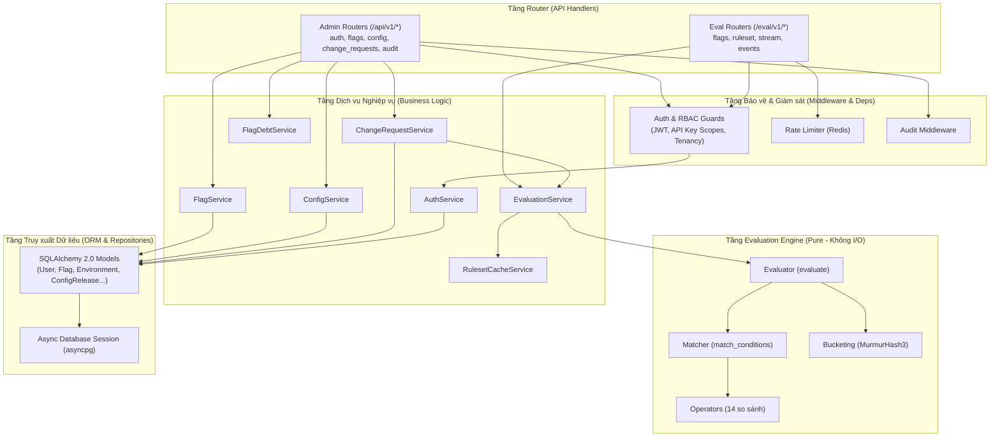

# FlagOps — Tài liệu Kiến trúc Hệ thống (Architecture Design Document)

Tài liệu này mô tả chi tiết kiến trúc phần mềm của **FlagOps** theo mô hình **C4 Model** (Context, Container, Component), các nguyên tắc kiến trúc bất biến và các quyết định thiết kế then chốt.

---

## 1. Bối cảnh Hệ thống (System Context - C4 Level 1)

Sơ đồ ngữ cảnh thể hiện ranh giới của FlagOps với các tác nhân người dùng và hệ thống bên ngoài:

### Các hệ thống tương tác:
- **Ứng dụng nghiệp vụ (Client Applications)**: Sử dụng FlagOps Python SDK hoặc JavaScript SDK để đánh giá cờ tính năng và lấy cấu hình dịch vụ.
- **Hệ thống giám sát (Observability)**: Thu thập các độ đo hiệu năng Prometheus từ FlagOps Core (`/metrics`).

---

## 2. Kiến trúc Container (Container Architecture - C4 Level 2)

Sơ đồ container mô tả các đơn vị thực thi độc lập (tiến trình, dịch vụ, kho lưu trữ dữ liệu) tạo nên nền tảng FlagOps:

---

## 3. Kiến trúc Thành phần Backend (Component Architecture - C4 Level 3)

Mô tả chi tiết cấu trúc phân tầng nghiêm ngặt bên trong `backend/app/`:

---

## 4. Các Quyết định Kiến trúc Then chốt (Architectural Decisions)

### 4.1. Quy tắc Phụ thuộc Một chiều Tuyệt đối
Hệ thống tuân thủ mô hình phân tầng chặt chẽ:
$$\text{API} \longrightarrow \text{Services} \longrightarrow \text{Repositories / Models} \longrightarrow \text{Database}$$
- **Quy tắc 1**: Tầng Router (API) chỉ gọi xuống Services; không bao giờ truy vấn trực tiếp CSDL.
- **Quy tắc 2**: Tầng Evaluation Engine (`app/engine/`) là trung tâm tính toán thuần túy. Engine **tuyệt đối không import** bất kỳ module nào thuộc tầng trên (không import `models`, `services`, `api`, `sqlalchemy`, `redis`, `httpx`).

### 4.2. Tính Thuần khiết của Engine Đánh giá (Evaluation Engine Purity)
- Engine nhận đầu vào là cấu trúc dữ liệu thuần (`Ruleset` và `EvaluationContext`) và trả về `EvaluationResult`.
- Không thực hiện bất kỳ thao tác I/O nào (không đọc đĩa, không gọi mạng, không đọc đồng hồ hệ thống `datetime.now()`, không dùng số ngẫu nhiên `random`).
- **Lợi ích kiến trúc**:
  1. Engine có thể nhúng trực tiếp vào SDK Python (In-process evaluation) mà không cần viết lại logic, đạt tính tương đương 100% (Bit-for-bit parity).
  2. Dễ dàng kiểm thử tự động với Property-based Testing (`hypothesis`).
  3. Cực kỳ nhanh ($< 15\ \mu\text{s}$ cho mỗi lần evaluate).

### 4.3. Phân tách Hai Đường Đọc/Ghi (Read/Write Separation)
- **Đường Quản trị (Admin Path - `/api/v1/*`)**:
  - Đối tượng: Người dùng Web Dashboard.
  - Lưu lượng: Thấp đến trung bình ($\sim 10 - 100\ \text{req/s}$).
  - Xác thực: JWT Bearer Token, kiểm tra quyền RBAC 4 vai trò.
  - Thao tác: Ghi dữ liệu vào PostgreSQL, kích hoạt event lên Redis.
- **Đường Đánh giá (Evaluation Path - `/eval/v1/*`)**:
  - Đối tượng: Hàng nghìn instance SDK của ứng dụng khách.
  - Lưu lượng: Cực lớn ($\ge 10.000\ \text{req/s}$).
  - Xác thực: Khóa `X-FlagOps-Key` (băm SHA-256 đối chiếu bộ nhớ đệm).
  - Thao tác: Đọc thuần túy từ Redis Cache hoặc In-memory Ruleset.

### 4.4. Cơ chế Đẩy Thời gian thực & Invalidation Phân tán
1. Quản trị viên thay đổi trạng thái flag hoặc cấu hình trên Dashboard.
2. Core API cập nhật bản ghi trong PostgreSQL và tăng `ruleset_version` của môi trường.
3. Core API xóa cache Redis cục bộ và gửi thông điệp `ruleset_invalidated` lên kênh `flagops:invalidation` của Redis Pub/Sub.
4. Các instance của SSE Hub (có thể scale ngang) nhận thông điệp và truyền phát sự kiện `ruleset_updated` kèm số version mới tới tất cả các kết nối SSE đang mở của SDK.
5. SDK nhận được sự kiện, ngay lập tức gửi yêu cầu `GET /eval/v1/ruleset` kèm header `If-None-Match: "<old_version>"`.
6. Server trả về ruleset mới, SDK cập nhật bộ nhớ RAM nguyên tử. Toàn bộ tiến trình diễn ra trong $< 2.0\ \text{giây}$.

---

## 5. Kiến trúc Bảo mật & Độ tin cậy (Security & Resilience)

| Vấn đề kiến trúc | Giải pháp thiết kế trong FlagOps |
|---|---|
| **Bảo vệ ranh giới tổ chức (Multi-tenancy)** | Xác thực `organization_id` ở tầng dependency. Truy cập trái phép trả về mã `404 Not Found` thay vì `403` để chống Information Disclosure. |
| **Bảo mật bí mật cấu hình (Secret Management)** | Mã hóa khóa đối xứng AES-256-GCM với Initialization Vector (IV) 12 bytes ngẫu nhiên trước khi lưu trường `value` của bảng `config_item`. |
| **Chống treo hệ thống bởi Regex (ReDoS)** | Khống chế thời gian chạy của `regex.match` với timeout 200ms bằng luồng bảo vệ độc lập; từ chối các pattern độc hại. |
| **Ngăn chặn cạn kiệt ngăn xếp (Stack Overflow)** | Giới hạn độ sâu tối đa của cây điều kiện JSONB là 10 tầng; kiểm tra đệ quy trước khi nạp vào engine. |
| **Độ tin cậy SDK (Fail-safe Fallback)** | SDK bọc toàn bộ khối xử lý mạng bằng khối `try-except Exception`, luôn trả về giá trị mặc định được định nghĩa trước khi có sự cố. |
