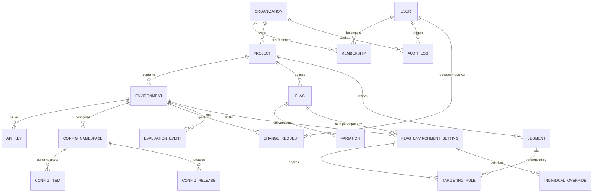

# FlagOps — Đặc tả Mô hình Dữ liệu (Data Model Specification)

Tài liệu này đặc tả toàn bộ lược đồ cơ sở dữ liệu PostgreSQL của hệ thống FlagOps. Toàn bộ lược đồ được quản lý bởi **Alembic migrations** (`backend/alembic/versions/`) và ánh xạ thông qua **SQLAlchemy 2.0 Declarative Models** (`backend/app/models/`).

---

## 1. Sơ đồ Thực thể Liên kết (Entity Relationship Diagram)

---

## 2. Đặc tả Chi tiết Các Bảng Dữ liệu

### 2.1. Phân hệ Định danh & Quản trị Tổ chức

#### Bảng `user`
Lưu trữ thông tin tài khoản người dùng quản trị. Mật khẩu được băm bảo mật bằng thuật toán Argon2id (`passlib[argon2]`).

| Cột | Kiểu dữ liệu | Ràng buộc | Nullable | Mô tả |
|---|---|---|---|---|
| `id` | `UUID` | PK, gen_random_uuid() | False | Khóa chính duy nhất |
| `email` | `VARCHAR(255)` | UNIQUE, INDEX | False | Email người dùng |
| `password_hash` | `TEXT` | - | False | Chuỗi băm mật khẩu Argon2id |
| `full_name` | `VARCHAR(120)` | - | False | Tên đầy đủ người dùng |
| `is_active` | `BOOLEAN` | default: true | False | Trạng thái hoạt động |
| `last_login_at` | `TIMESTAMP WITH TIME ZONE` | - | True | Thời điểm đăng nhập gần nhất |
| `created_at` | `TIMESTAMP WITH TIME ZONE` | default: now() | False | Thời gian tạo |
| `updated_at` | `TIMESTAMP WITH TIME ZONE` | default: now() | False | Thời gian cập nhật |

#### Bảng `organization`
Đại diện cho tổ chức hoặc doanh nghiệp cấp cao nhất (Multi-tenancy isolation).

| Cột | Kiểu dữ liệu | Ràng buộc | Nullable | Mô tả |
|---|---|---|---|---|
| `id` | `UUID` | PK, gen_random_uuid() | False | Khóa chính |
| `name` | `VARCHAR(120)` | - | False | Tên tổ chức |
| `slug` | `VARCHAR(60)` | UNIQUE, INDEX | False | Định danh đường dẫn thân thiện |
| `created_at` | `TIMESTAMP WITH TIME ZONE` | default: now() | False | Thời gian tạo |
| `updated_at` | `TIMESTAMP WITH TIME ZONE` | default: now() | False | Thời gian cập nhật |

#### Bảng `membership`
Quan hệ nhiều-nhiều giữa người dùng và tổ chức, gán vai trò RBAC (`OWNER`, `ADMIN`, `DEVELOPER`, `VIEWER`).

| Cột | Kiểu dữ liệu | Ràng buộc | Nullable | Mô tả |
|---|---|---|---|---|
| `id` | `UUID` | PK, gen_random_uuid() | False | Khóa chính |
| `user_id` | `UUID` | FK -> `user.id` (CASCADE) | False | Tham chiếu người dùng |
| `organization_id` | `UUID` | FK -> `organization.id` (CASCADE) | False | Tham chiếu tổ chức |
| `role` | `VARCHAR(20)` | Enum: OWNER, ADMIN, DEVELOPER, VIEWER | False | Vai trò phân quyền RBAC |
| `created_at` | `TIMESTAMP WITH TIME ZONE` | default: now() | False | Thời gian gán vai trò |
| `updated_at` | `TIMESTAMP WITH TIME ZONE` | default: now() | False | Thời gian cập nhật |

*Ràng buộc duy nhất*: `UNIQUE(user_id, organization_id)`.

---

### 2.2. Phân hệ Dự án & Môi trường

#### Bảng `project`
Nhóm các flag và config thuộc một dịch vụ/sản phẩm bên trong tổ chức.

| Cột | Kiểu dữ liệu | Ràng buộc | Nullable | Mô tả |
|---|---|---|---|---|
| `id` | `UUID` | PK, gen_random_uuid() | False | Khóa chính |
| `organization_id` | `UUID` | FK -> `organization.id` (CASCADE) | False | Thuộc về tổ chức |
| `name` | `VARCHAR(120)` | - | False | Tên dự án |
| `slug` | `VARCHAR(60)` | - | False | Định danh dự án |
| `default_stale_days` | `INTEGER` | default: 30 | False | Ngưỡng số ngày đánh dấu cờ chết |
| `created_at` | `TIMESTAMP WITH TIME ZONE` | default: now() | False | Thời gian tạo |
| `updated_at` | `TIMESTAMP WITH TIME ZONE` | default: now() | False | Thời gian cập nhật |

*Ràng buộc duy nhất*: `UNIQUE(organization_id, slug)`.

#### Bảng `environment`
Môi trường triển khai độc lập (`development`, `staging`, `production`).

| Cột | Kiểu dữ liệu | Ràng buộc | Nullable | Mô tả |
|---|---|---|---|---|
| `id` | `UUID` | PK, gen_random_uuid() | False | Khóa chính |
| `project_id` | `UUID` | FK -> `project.id` (CASCADE) | False | Thuộc về dự án |
| `name` | `VARCHAR(60)` | - | False | Tên môi trường hiển thị |
| `key` | `VARCHAR(60)` | - | False | Khóa môi trường (`dev`, `staging`, `prod`) |
| `is_production` | `BOOLEAN` | default: false | False | Cờ kích hoạt Change Request bắt buộc |
| `ruleset_version` | `BIGINT` | default: 1 | False | Version tăng đơn điệu dùng cho ETag/304 |
| `created_at` | `TIMESTAMP WITH TIME ZONE` | default: now() | False | Thời gian tạo |
| `updated_at` | `TIMESTAMP WITH TIME ZONE` | default: now() | False | Thời gian cập nhật |

*Ràng buộc duy nhất*: `UNIQUE(project_id, key)`.

#### Bảng `api_key`
Khóa xác thực cho SDK client-side và server-side gọi vào API đánh giá (`/eval/v1/*`).

| Cột | Kiểu dữ liệu | Ràng buộc | Nullable | Mô tả |
|---|---|---|---|---|
| `id` | `UUID` | PK, gen_random_uuid() | False | Khóa chính |
| `environment_id` | `UUID` | FK -> `environment.id` (CASCADE) | False | Gắn với môi trường cụ thể |
| `name` | `VARCHAR(120)` | - | False | Tên mô tả khóa |
| `key_hash` | `VARCHAR(64)` | UNIQUE, INDEX | False | Chuỗi băm SHA-256 của secret key |
| `key_prefix` | `VARCHAR(12)` | - | False | Tiền tố nhận diện (`fo_srv_` hoặc `fo_cli_`) |
| `scope` | `VARCHAR(6)` | Enum: SERVER, CLIENT | False | Phạm vi phân quyền API key |
| `expires_at` | `TIMESTAMP WITH TIME ZONE` | - | True | Ngày hết hạn |
| `revoked_at` | `TIMESTAMP WITH TIME ZONE` | - | True | Thời điểm bị thu hồi |
| `created_at` | `TIMESTAMP WITH TIME ZONE` | default: now() | False | Thời gian tạo |
| `updated_at` | `TIMESTAMP WITH TIME ZONE` | default: now() | False | Thời gian cập nhật |

---

### 2.3. Phân hệ Feature Flag & Đánh giá

#### Bảng `flag`
Định nghĩa cờ tính năng bất biến theo dự án.

| Cột | Kiểu dữ liệu | Ràng buộc | Nullable | Mô tả |
|---|---|---|---|---|
| `id` | `UUID` | PK, gen_random_uuid() | False | Khóa chính |
| `project_id` | `UUID` | FK -> `project.id` (CASCADE) | False | Thuộc về dự án |
| `key` | `VARCHAR(160)` | - | False | Khóa bất biến dùng trong mã nguồn ứng dụng |
| `name` | `VARCHAR(120)` | - | False | Tên hiển thị |
| `description` | `TEXT` | - | True | Mô tả mục đích tính năng |
| `type` | `VARCHAR(7)` | Enum: BOOLEAN, STRING, NUMBER, JSON | False | Kiểu dữ liệu biến thể |
| `toggle_kind` | `VARCHAR(10)` | Enum: RELEASE, EXPERIMENT, OPS, PERMISSION | False | Phân loại Martin Fowler |
| `is_temporary` | `BOOLEAN` | default: true | False | Đánh dấu toggle tạm thời |
| `is_client_visible` | `BOOLEAN` | default: false | False | Cho phép CLIENT key truy cập |
| `tags` | `ARRAY(String)` | default: [] | False | Danh sách nhãn phân loại |
| `archived_at` | `TIMESTAMP WITH TIME ZONE` | - | True | Thời điểm lưu trữ (soft delete) |
| `created_by` | `UUID` | FK -> `user.id` | True | Người tạo cờ |
| `created_at` | `TIMESTAMP WITH TIME ZONE` | default: now() | False | Thời gian tạo |
| `updated_at` | `TIMESTAMP WITH TIME ZONE` | default: now() | False | Thời gian cập nhật |

*Ràng buộc duy nhất*: `UNIQUE(project_id, key)`.

#### Bảng `variation`
Tập các biến thể giá trị của một flag.

| Cột | Kiểu dữ liệu | Ràng buộc | Nullable | Mô tả |
|---|---|---|---|---|
| `id` | `UUID` | PK, gen_random_uuid() | False | Khóa chính |
| `flag_id` | `UUID` | FK -> `flag.id` (CASCADE) | False | Thuộc về flag |
| `key` | `VARCHAR(80)` | - | False | Định danh biến thể (`on`, `off`, `variant_a`) |
| `value` | `JSONB` | - | False | Giá trị cụ thể của biến thể |
| `name` | `VARCHAR(120)` | - | True | Tên nhãn hiển thị |
| `description` | `TEXT` | - | True | Mô tả biến thể |
| `created_at` | `TIMESTAMP WITH TIME ZONE` | default: now() | False | Thời gian tạo |
| `updated_at` | `TIMESTAMP WITH TIME ZONE` | default: now() | False | Thời gian cập nhật |

*Ràng buộc duy nhất*: `UNIQUE(flag_id, key)`.

#### Bảng `flag_environment_setting`
Cấu hình trạng thái bật/tắt và variation mặc định theo từng môi trường.

| Cột | Kiểu dữ liệu | Ràng buộc | Nullable | Mô tả |
|---|---|---|---|---|
| `id` | `UUID` | PK, gen_random_uuid() | False | Khóa chính |
| `flag_id` | `UUID` | FK -> `flag.id` (CASCADE) | False | Flag liên quan |
| `environment_id` | `UUID` | FK -> `environment.id` (CASCADE) | False | Môi trường triển khai |
| `enabled` | `BOOLEAN` | default: false | False | Trạng thái công tắc chung |
| `default_variation_id` | `UUID` | FK -> `variation.id` | True | Biến thể khi bật mà không khớp rule |
| `off_variation_id` | `UUID` | FK -> `variation.id` | True | Biến thể khi cờ bị tắt |
| `bucketing_key` | `VARCHAR(60)` | default: "targetingKey" | False | Thuộc tính dùng băm phân nhánh |
| `last_evaluated_at` | `TIMESTAMP WITH TIME ZONE` | - | True | Ghi nhận thời điểm evaluate gần nhất |
| `created_at` | `TIMESTAMP WITH TIME ZONE` | default: now() | False | Thời gian tạo |
| `updated_at` | `TIMESTAMP WITH TIME ZONE` | default: now() | False | Thời gian cập nhật |

*Ràng buộc duy nhất*: `UNIQUE(flag_id, environment_id)`.

#### Bảng `segment`
Tập định nghĩa phân đoạn người dùng tái sử dụng trong dự án.

| Cột | Kiểu dữ liệu | Ràng buộc | Nullable | Mô tả |
|---|---|---|---|---|
| `id` | `UUID` | PK, gen_random_uuid() | False | Khóa chính |
| `project_id` | `UUID` | FK -> `project.id` (CASCADE) | False | Thuộc về dự án |
| `key` | `VARCHAR(160)` | - | False | Mã phân đoạn |
| `name` | `VARCHAR(120)` | - | False | Tên phân đoạn |
| `description` | `TEXT` | - | True | Mô tả |
| `conditions` | `JSONB` | - | False | Cây điều kiện lọc phân đoạn (AND/OR logic) |
| `created_at` | `TIMESTAMP WITH TIME ZONE` | default: now() | False | Thời gian tạo |
| `updated_at` | `TIMESTAMP WITH TIME ZONE` | default: now() | False | Thời gian cập nhật |

*Ràng buộc duy nhất*: `UNIQUE(project_id, key)`.

#### Bảng `targeting_rule`
Luật nhắm mục tiêu theo mức độ ưu tiên gắn với cờ trên môi trường.

| Cột | Kiểu dữ liệu | Ràng buộc | Nullable | Mô tả |
|---|---|---|---|---|
| `id` | `UUID` | PK, gen_random_uuid() | False | Khóa chính |
| `flag_environment_setting_id` | `UUID` | FK -> `flag_environment_setting.id` (CASCADE) | False | Cài đặt môi trường liên quan |
| `priority` | `INTEGER` | - | False | Độ ưu tiên (nhỏ hơn khớp trước) |
| `description` | `VARCHAR(255)` | - | True | Mô tả mục đích của luật |
| `segment_id` | `UUID` | FK -> `segment.id` | True | Phân đoạn áp dụng (tùy chọn) |
| `conditions` | `JSONB` | - | True | Điều kiện bổ sung dạng cây JSONB |
| `distribution` | `JSONB` | - | False | Tỷ lệ phần trăm chia variation (rollout) |
| `created_at` | `TIMESTAMP WITH TIME ZONE` | default: now() | False | Thời gian tạo |
| `updated_at` | `TIMESTAMP WITH TIME ZONE` | default: now() | False | Thời gian cập nhật |

#### Bảng `individual_override`
Gán cứng một biến thể cho danh sách người dùng cụ thể.

| Cột | Kiểu dữ liệu | Ràng buộc | Nullable | Mô tả |
|---|---|---|---|---|
| `id` | `UUID` | PK, gen_random_uuid() | False | Khóa chính |
| `flag_environment_setting_id` | `UUID` | FK -> `flag_environment_setting.id` (CASCADE) | False | Cài đặt môi trường liên quan |
| `context_key` | `VARCHAR(200)` | - | False | Giá trị khóa định danh user (`userId`) |
| `variation_id` | `UUID` | FK -> `variation.id` | False | Biến thể áp dụng cứng |
| `created_at` | `TIMESTAMP WITH TIME ZONE` | default: now() | False | Thời gian tạo |
| `updated_at` | `TIMESTAMP WITH TIME ZONE` | default: now() | False | Thời gian cập nhật |

*Ràng buộc duy nhất*: `UNIQUE(flag_environment_setting_id, context_key)`.

---

### 2.4. Phân hệ Quản trị Cấu hình (Remote Config)

#### Bảng `config_namespace`
Nhóm cấu hình theo dịch vụ/mô-đun trong môi trường.

| Cột | Kiểu dữ liệu | Ràng buộc | Nullable | Mô tả |
|---|---|---|---|---|
| `id` | `UUID` | PK, gen_random_uuid() | False | Khóa chính |
| `environment_id` | `UUID` | FK -> `environment.id` (CASCADE) | False | Thuộc về môi trường |
| `name` | `VARCHAR(120)` | - | False | Tên namespace (`payment`, `database`, `ui`) |
| `format` | `VARCHAR(10)` | Enum: PROPERTIES, JSON, YAML | False | Định dạng hiển thị cấu hình |
| `current_release_id` | `UUID` | FK -> `config_release.id` | True | Bản release đang hiệu lực |
| `created_at` | `TIMESTAMP WITH TIME ZONE` | default: now() | False | Thời gian tạo |
| `updated_at` | `TIMESTAMP WITH TIME ZONE` | default: now() | False | Thời gian cập nhật |

*Ràng buộc duy nhất*: `UNIQUE(environment_id, name)`.

#### Bảng `config_item`
Mục cấu hình đang ở trạng thái bản nháp (Draft staging) chưa phát hành.

| Cột | Kiểu dữ liệu | Ràng buộc | Nullable | Mô tả |
|---|---|---|---|---|
| `id` | `UUID` | PK, gen_random_uuid() | False | Khóa chính |
| `namespace_id` | `UUID` | FK -> `config_namespace.id` (CASCADE) | False | Thuộc về namespace |
| `key` | `VARCHAR(200)` | - | False | Tên tham số cấu hình |
| `value` | `TEXT` | - | False | Giá trị (bản rõ hoặc ciphertext mã hóa) |
| `value_type` | `VARCHAR(6)` | Enum: STRING, NUMBER, BOOLEAN, JSON | False | Kiểu dữ liệu tham số |
| `is_secret` | `BOOLEAN` | default: false | False | Cờ mã hóa bảo mật AES-256-GCM |
| `json_schema` | `JSONB` | - | True | JSON Schema validate giá trị |
| `comment` | `TEXT` | - | True | Ghi chú hướng dẫn sử dụng |
| `created_at` | `TIMESTAMP WITH TIME ZONE` | default: now() | False | Thời gian tạo |
| `updated_at` | `TIMESTAMP WITH TIME ZONE` | default: now() | False | Thời gian cập nhật |

*Ràng buộc duy nhất*: `UNIQUE(namespace_id, key)`.

#### Bảng `config_release`
Bản phát hành cấu hình đóng băng bất biến (Immutable Snapshot Release) có thể rollback.

| Cột | Kiểu dữ liệu | Ràng buộc | Nullable | Mô tả |
|---|---|---|---|---|
| `id` | `UUID` | PK, gen_random_uuid() | False | Khóa chính |
| `namespace_id` | `UUID` | FK -> `config_namespace.id` (CASCADE) | False | Thuộc về namespace |
| `version` | `INTEGER` | - | False | Số phiên bản tăng dần tự động (1, 2, 3...) |
| `snapshot` | `JSONB` | - | False | Toàn bộ cặp key-value đóng băng tại thời điểm publish |
| `comment` | `TEXT` | - | True | Ghi chú bản phát hành |
| `released_by` | `UUID` | FK -> `user.id` | True | Người thực hiện publish |
| `released_at` | `TIMESTAMP WITH TIME ZONE` | default: now() | False | Thời điểm phát hành |
| `is_rollback_of` | `UUID` | FK -> `config_release.id` | True | Tham chiếu nếu là hành động rollback |
| `created_at` | `TIMESTAMP WITH TIME ZONE` | default: now() | False | Thời gian tạo bản ghi |
| `updated_at` | `TIMESTAMP WITH TIME ZONE` | default: now() | False | Thời gian cập nhật |

*Ràng buộc duy nhất*: `UNIQUE(namespace_id, version)`.

---

### 2.5. Phân hệ Quy trình Quản trị & Giám sát

#### Bảng `change_request`
Quy trình kiểm soát thay đổi theo nguyên tắc 4 mắt (Four-Eyes Principle) trên môi trường Production.

| Cột | Kiểu dữ liệu | Ràng buộc | Nullable | Mô tả |
|---|---|---|---|---|
| `id` | `UUID` | PK, gen_random_uuid() | False | Khóa chính |
| `environment_id` | `UUID` | FK -> `environment.id` (CASCADE) | False | Môi trường mục tiêu |
| `title` | `VARCHAR(200)` | - | False | Tiêu đề đề xuất thay đổi |
| `description` | `TEXT` | - | True | Giải trình nguyên nhân thay đổi |
| `payload` | `JSONB` | - | False | Tập thay đổi cấu hình dự kiến thi hành |
| `status` | `VARCHAR(9)` | Enum: DRAFT, PENDING, APPROVED, REJECTED, APPLIED, CANCELLED | False | Trạng thái vòng đời đề xuất |
| `requested_by` | `UUID` | FK -> `user.id` | False | Người tạo đề xuất (không được tự duyệt) |
| `reviewed_by` | `UUID` | FK -> `user.id` | True | Người duyệt (Admin / Owner khác) |
| `scheduled_at` | `TIMESTAMP WITH TIME ZONE` | - | True | Thời điểm hẹn giờ áp dụng |
| `applied_at` | `TIMESTAMP WITH TIME ZONE` | - | True | Thời điểm thay đổi được thực thi |
| `created_at` | `TIMESTAMP WITH TIME ZONE` | default: now() | False | Thời gian tạo |
| `updated_at` | `TIMESTAMP WITH TIME ZONE` | default: now() | False | Thời gian cập nhật |

#### Bảng `audit_log`
Lịch sử kiểm toán bất biến ghi nhận mọi thao tác cấu hình và truy cập quản trị.

| Cột | Kiểu dữ liệu | Ràng buộc | Nullable | Mô tả |
|---|---|---|---|---|
| `id` | `BIGINT` | PK, autoincrement | False | Khóa chính số nguyên |
| `organization_id` | `UUID` | FK -> `organization.id` | True | Tổ chức bị tác động |
| `project_id` | `UUID` | FK -> `project.id` | True | Dự án bị tác động |
| `environment_id` | `UUID` | FK -> `environment.id` | True | Môi trường bị tác động |
| `actor_id` | `UUID` | FK -> `user.id` | True | Người thực hiện hành động |
| `action` | `VARCHAR(80)` | - | False | Tên hành động (`FLAG_CREATE`, `CONFIG_PUBLISH`) |
| `entity_type` | `VARCHAR(50)` | - | False | Loại thực thể (`flag`, `config_release`, `rule`) |
| `entity_id` | `VARCHAR(64)` | - | True | ID thực thể bị tác động |
| `before` | `JSONB` | - | True | Trạng thái thực thể trước khi đổi |
| `after` | `JSONB` | - | True | Trạng thái thực thể sau khi đổi |
| `ip_address` | `INET` | - | True | Địa chỉ IP máy trạm thực hiện |
| `user_agent` | `TEXT` | - | True | Thông tin trình duyệt/công cụ gọi API |
| `created_at` | `TIMESTAMP WITH TIME ZONE` | default: now() | False | Thời điểm diễn ra hành động |

#### Bảng `evaluation_event` (Partitioned Table)
Bảng sự kiện đánh giá ghi nhận tần suất sử dụng phục vụ tính toán nợ kỹ thuật và phân tích A/B. Được phân vùng theo dải thời gian (`RANGE (created_at)`).

| Cột | Kiểu dữ liệu | Ràng buộc | Nullable | Mô tả |
|---|---|---|---|---|
| `id` | `BIGINT` | PK (kết hợp) | False | Định danh sự kiện |
| `environment_id` | `UUID` | - | False | Môi trường đánh giá |
| `flag_id` | `UUID` | - | False | Flag được đánh giá |
| `variation_id` | `UUID` | - | False | Biến thể kết quả |
| `reason` | `VARCHAR(30)` | - | False | Mã lý do đánh giá |
| `context_key_hash` | `VARCHAR(64)` | - | False | Băm SHA-256 ẩn danh của context key |
| `context` | `JSONB` | - | True | Thuộc tính ngữ cảnh thu gọn |
| `created_at` | `TIMESTAMP WITH TIME ZONE` | PK (kết hợp), default: now() | False | Thời điểm đánh giá |

*Khóa chính kết hợp*: `PrimaryKeyConstraint("id", "created_at")`.
