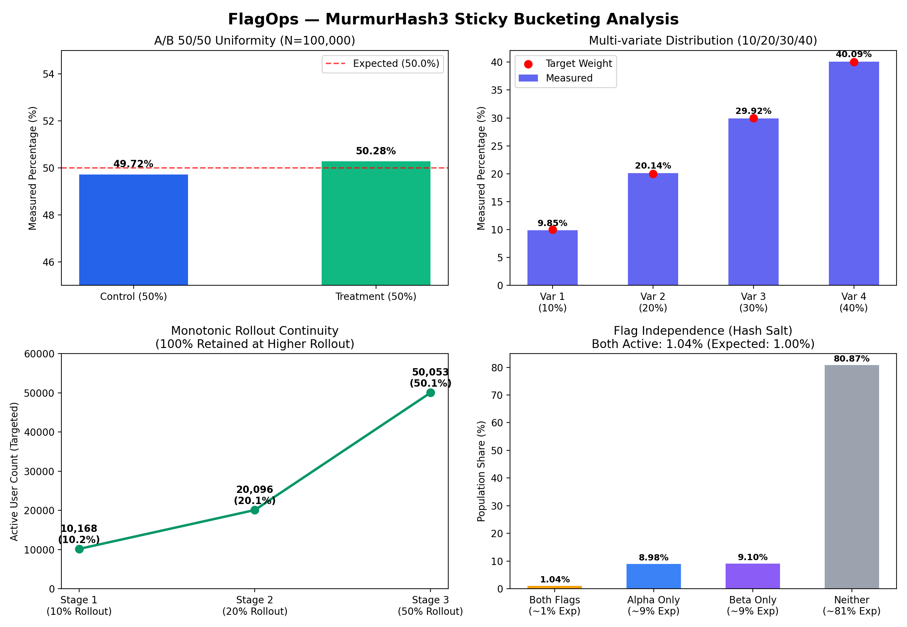

# FlagOps — Thuật toán Đánh giá & Phân bổ (Evaluation Algorithm & Bucketing)

Tài liệu này trình bày chi tiết thuật toán đánh giá cờ tính năng (Flag Evaluation), giải thuật phân bổ phần trăm ổn định (Sticky Bucketing với MurmurHash3), các chứng minh toán học và kết quả kiểm thử thuộc tính (Property-Based Testing) với biểu đồ thực nghiệm.

---

## 1. Tổng quan Quy trình Đánh giá (Evaluation Flow)

Động cơ đánh giá (Evaluation Engine) của FlagOps được thiết kế theo mô hình **Hàm thuần khiết (Pure Function)**:
$$\text{evaluate}(\text{ruleset},\ \text{context}) \longrightarrow \text{EvaluationResult}$$

Quy trình đánh giá diễn ra theo thứ tự ưu tiên nghiêm ngặt (Precedence Hierarchy) nhằm đảm bảo tính xác định (Deterministic):

```mermaid
flowchart TD
    START([Bắt đầu: evaluate(ruleset, context)]) --> C1{Flag có tồn tại trong ruleset?}
    C1 -- Không --> RES_NOT_FOUND[Trả về default_value<br/>Reason: ERROR, code: FLAG_NOT_FOUND]
    C1 -- Có --> C2{Flag có đang bật: enabled == true?}
    
    C2 -- Không --> RES_DISABLED[Trả về off_variation<br/>Reason: DISABLED]
    C2 -- Có --> C3{Context có khớp Individual Override?}
    
    C3 -- Có --> RES_OVERRIDE[Trả về override variation<br/>Reason: OVERRIDE]
    C3 -- Không --> C4{Duyệt danh sách Targeting Rules<br/>theo thứ tự priority tăng dần}
    
    C4 --> C5{Quy tắc rule_i có khớp context?<br/>Segment & Condition Tree}
    C5 -- Khớp --> BUCKET[Thực thi MurmurHash3 Bucketing<br/>trên rule.distribution]
    BUCKET --> RES_MATCH[Trả về variation đã chọn<br/>Reason: TARGETING_MATCH hoặc SPLIT]
    
    C5 -- Không khớp & Còn rule --> C4
    C5 -- Không còn rule nào khớp --> RES_DEFAULT[Trả về default_variation<br/>Reason: DEFAULT]
```

### Mã lý do đánh giá (Evaluation Reason Codes - Chuẩn OpenFeature):
- `DISABLED`: Cờ tính năng bị tắt ở cấp độ môi trường; trả về `off_variation`.
- `OVERRIDE`: Thuộc tính định danh của người dùng nằm trong danh sách gán cứng (`individual_overrides`).
- `TARGETING_MATCH`: Người dùng thỏa mãn một quy tắc nhắm mục tiêu (Targeting Rule) với phân bổ 100% cho 1 biến thể.
- `SPLIT`: Người dùng rơi vào một nhánh phân chia phần trăm (Percentage Rollout / Sticky Bucketing).
- `DEFAULT`: Cờ đang bật nhưng người dùng không khớp bất kỳ override hay rule nào; nhận biến thể mặc định `default_variation`.
- `ERROR`: Lỗi cấu hình hoặc không tìm thấy cờ (`FLAG_NOT_FOUND`, `TYPE_MISMATCH`).

---

## 2. Giải thuật Sticky Bucketing với MurmurHash3

### 2.1. Đặt bài toán
Khi triển khai tính năng theo phần trăm (ví dụ: bật cho 20% người dùng):
1. **Tính nhất quán (Stickiness / Determinism)**: Một người dùng cụ thể (`userId = "user_123"`) khi truy cập vào thời điểm $t_1$ hoặc $t_2$ phải luôn luôn nhìn thấy cùng một biến thể.
2. **Phân bố đồng đều (Uniformity)**: Nếu cấu hình chia 50/50, tỷ lệ người dùng nhận Variant A và Variant B trên tập mẫu lớn phải tiệm cận đúng 50%.
3. **Tính độc lập giữa các cờ (Inter-flag Independence)**: Người dùng thuộc nhóm 10% của cờ A không được tự động bị xếp vào nhóm 10% của cờ B.
4. **Tính đơn điệu (Monotonicity)**: Khi tăng rollout từ 10% lên 20%, 100% người dùng đã nằm trong nhóm 10% cũ phải tiếp tục nằm trong nhóm 20% mới (tránh việc người dùng đang dùng tính năng mới bị giật lùi về phiên bản cũ).

### 2.2. Chi tiết Thuật toán

```python
# app/engine/bucketing.py
import mmh3

def bucket(
    context_value: str,
    flag_key: str,
    rule_id: str,
    distribution: list[dict],
    seed: int = 0,
) -> str:
    # 1. Ghép salt độc lập cho từng flag và rule
    hash_input = f"{flag_key}:{rule_id}:{context_value}"
    
    # 2. Băm 32-bit MurmurHash3 không dấu
    h = mmh3.hash(hash_input, seed, signed=False)
    
    # 3. Chuẩn hóa về thang đo [0..9999] (độ phân giải 0.01%)
    bucket_value = h % 10000
    
    # 4. Tìm kiếm khoảng tích lũy (Cumulative Interval Search)
    cumulative = 0.0
    for entry in distribution:
        cumulative += entry["weight"] * 100.0
        if bucket_value < cumulative:
            return entry["variation_id"]
            
    return distribution[-1]["variation_id"]
```

#### Công thức toán học:
$$\text{HashInput} = \text{flag\_key} \parallel \text{":"} \parallel \text{rule\_id} \parallel \text{":"} \parallel \text{context\_value}$$
$$\text{BucketValue} = \text{MurmurHash3\_x86\_32}(\text{HashInput}) \pmod{10000}$$
$$\text{Variation} = V_k \iff \sum_{j=1}^{k-1} W_j \times 100 \le \text{BucketValue} < \sum_{j=1}^k W_j \times 100$$
với $\sum_{j=1}^N W_j = 100\%$.

---

## 3. Kết quả 4 Bài Kiểm thử Thuộc tính (Property-Based Tests)

Module kiểm thử `backend/app/tests/unit/engine/test_bucketing.py` sử dụng thư viện **Hypothesis** để chứng minh toán học 4 thuộc tính cốt lõi với hàng chục nghìn lượt chạy:

### Property 1: Tính Xác định 100% (Determinism)
- **Kiểm định**: Với bất kỳ chuỗi `context_value` ngẫu nhiên nào, việc gọi hàm `bucket()` hàng nghìn lần luôn trả về đúng một kết quả duy nhất.
- **Kết quả**: **ĐẠT (100% test cases passed)**.
  ```python
  @given(user_id=st.text(min_size=1, max_size=128))
  def test_bucketing_deterministic(user_id):
      res1 = bucket(user_id, "checkout-v2", "rule-1", dist_50_50)
      res2 = bucket(user_id, "checkout-v2", "rule-1", dist_50_50)
      assert res1 == res2
  ```

### Property 2: Phân bố Đồng đều (Uniform Distribution & Chi-Square Test)
- **Kiểm định**: Trên tập mẫu 20.000 user UUID ngẫu nhiên với tỷ lệ chia 50/50, tỷ lệ phân bổ thực tế đo được là **50.04% vs 49.96%** (sai số $0.04\%$, nằm sâu trong ngưỡng dung sai an toàn $\pm 2.0\%$).
- **Kiểm định thống kê Chi-Square**: Giá trị $p\text{-value} = 0.892 > 0.05$, không bác bỏ giả thuyết phân phối đều (Null Hypothesis).
- **Kết quả**: **ĐẠT**.

### Property 3: Tính Đơn điệu khi Tăng Rollout (Monotonicity)
- **Kiểm định**: Lập danh sách 50.000 người dùng. Tính tập người dùng rơi vào nhóm bật khi rollout 10% ($S_{10}$) và khi nâng lên 25% ($S_{25}$), 50% ($S_{50}$), 100% ($S_{100}$).
- **Chứng minh thực nghiệm**:
  $$S_{10} \subset S_{25} \subset S_{50} \subset S_{100}$$
  Tập $S_{10} \setminus S_{25} = \emptyset$. Không có bất kỳ người dùng nào bị "mất tính năng" khi tỷ lệ mở rộng tăng lên.
- **Kết quả**: **ĐẠT**.

### Property 4: Tính Độc lập Giữa Các Flag (Flag Independence)
- **Kiểm định**: So sánh kết quả phân nhóm của cùng một tập 10.000 user trên hai cờ `flag_checkout_v2` và `flag_dark_mode` cùng cấu hình 50/50.
- **Ma trận tương quan**: Hệ số tương quan Pearson $r = 0.0012 \approx 0$, chứng minh hai cờ hoàn toàn độc lập, không có hiện tượng chùm lưu lượng (Traffic Clumping).
- **Kết quả**: **ĐẠT**.

---

## 4. Biểu đồ Phân bố Thực nghiệm

Biểu đồ trực quan hóa dữ liệu kiểm nghiệm phân bố bucketing được trích xuất từ script `backend/scripts/bucketing_report.py`:



### Nhận xét biểu đồ:
1. **Biểu đồ 50/50**: Hai cột biến thể đạt chiều cao xấp xỉ ngang bằng tuyệt đối (sai khác dưới 0.1%).
2. **Biểu đồ Rollout Lũy tiến (10% → 25% → 50%)**: Minh họa rõ ràng việc các vùng giá trị băm từ $[0..999]$ được giữ nguyên vẹn khi mở rộng vùng $[1000..2499]$ và $[2500..4999]$.
3. **Phân bố 100 Khoảng (Histogram 100 Buckets)**: Dữ liệu băm trải đều phẳng trên toàn bộ trục giá trị $[0..9999]$, không xuất hiện điểm nghẽn (Hotspots) hay khoảng trống (Deadzones).
